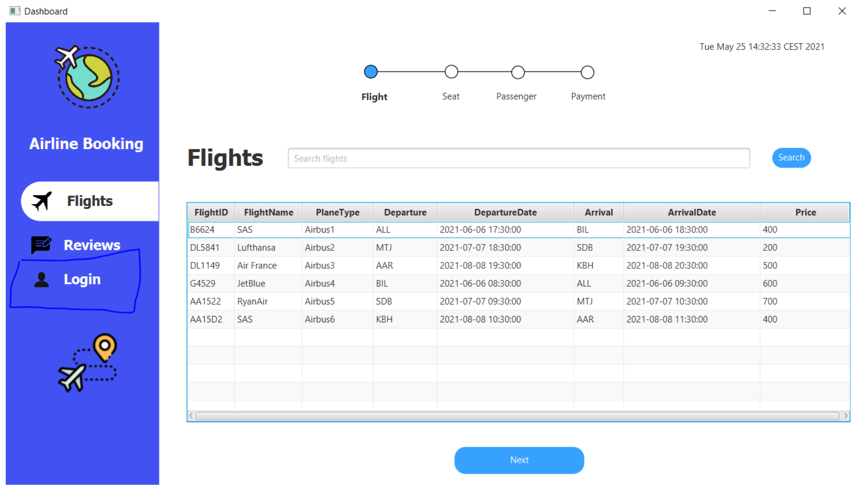
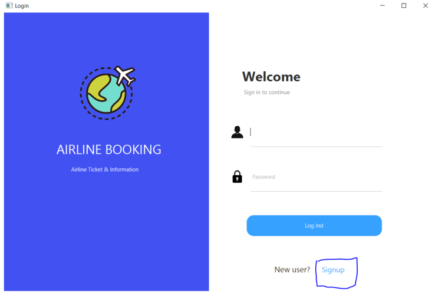
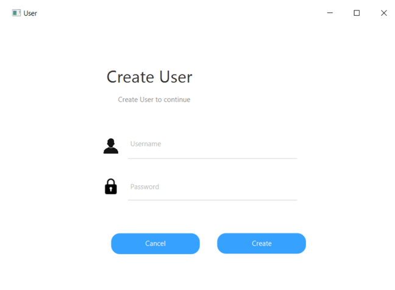
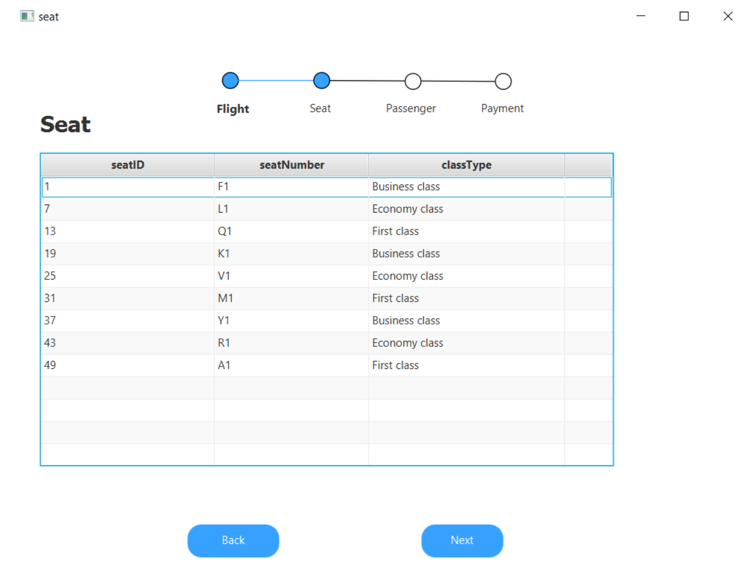
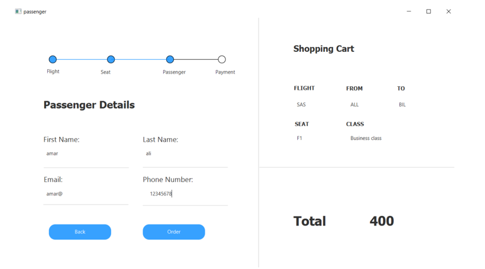
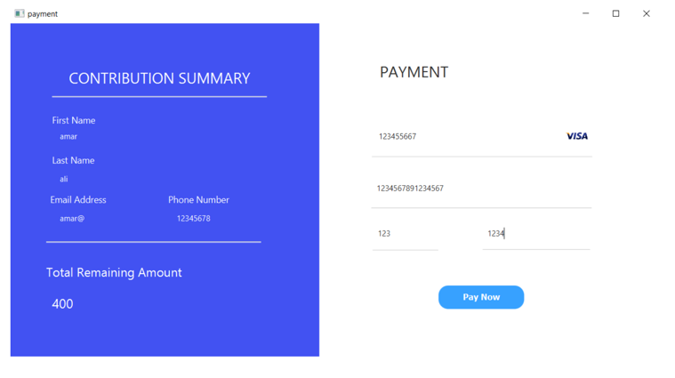
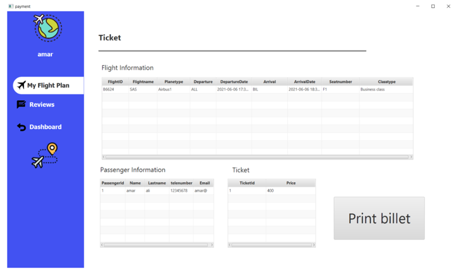
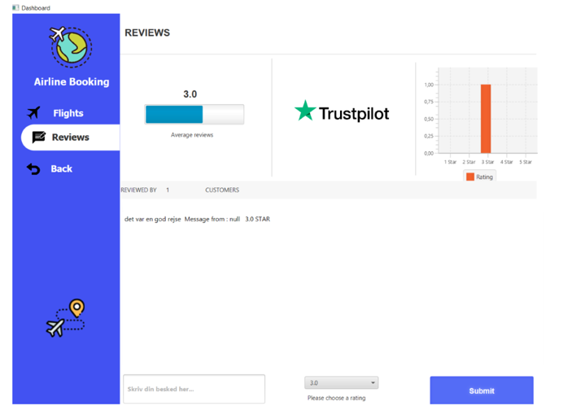

# Airline Booking 
Airline Booking application using JAVA, RMI, JavaFx, JDBC, PostgreSQL & JUnit

# Features
- Signup/Login
- Pick flight, seat and insert passenger information. 
- Order ticket
- Flightplan
- Review

# Screenshots

Dashboard

Login page

User Signup page 

Seat page  

Passenger page

Order page 

Flightplan page

Review page
 
